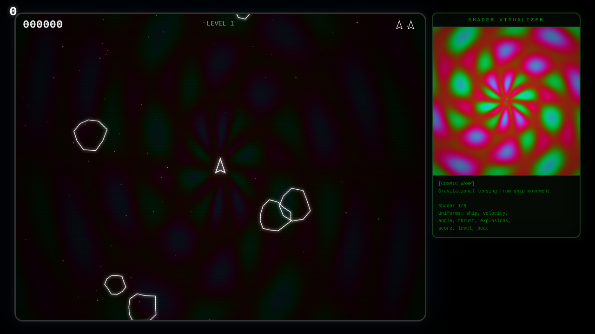

# A-STEROIDS

A browser-based Asteroids clone with a live **WebGL shader visualizer** that reacts to your gameplay in real time.



## Gameplay

Fly your ship through waves of asteroids, blast them to pieces, and survive as long as you can. Asteroids split into smaller fragments when hit. Clear the field to advance to the next level — each one gets faster and more chaotic.

- **Shoot** asteroids to break them apart
- **Hyperspace** to jump to a random position in a pinch
- **Lives** are lost on collision — game over when you run out

## Controls

| Action | Keys |
|---|---|
| Rotate | Arrow Left / Right &nbsp;&nbsp;or&nbsp;&nbsp; A / D |
| Thrust | Arrow Up &nbsp;&nbsp;or&nbsp;&nbsp; W |
| Fire | Space |
| Hyperspace | Shift &nbsp;&nbsp;or&nbsp;&nbsp; H |
| Pause | P &nbsp;&nbsp;or&nbsp;&nbsp; Escape |
| Cycle shader | V |
| Toggle shader background | B |
| Mute audio | M |

Mobile touch controls are also supported.

## WebGL Shader Visualizer

A-Steroids includes a real-time GLSL fragment shader panel inspired by [twigl](https://twigl.app). The shader isn't just decorative — it's **driven by live game state** via uniforms:

- Ship position, velocity, and angle
- Thrust intensity
- Score and current level
- Explosion position and age
- Beat pulse
- Hyperspace flash

### Shader Modes

Cycle through 5 shader modes with **V**:

| Mode | Description |
|---|---|
| **Cosmic Warp** | Gravitational lensing that bends around your ship |
| **Fractal Nebula** | Julia set fractal shaped by your flight path and angle |
| **Plasma Pulse** | Classic sine-wave plasma modulated by explosions |
| **Wormhole** | Hyperdimensional tunnel that warps with your velocity |
| **Digital Rain** | Matrix-style data streams energized by movement |

The active shader also runs as a subtle animated background overlay (**B** to toggle).

## Running Locally

No build step required — just open `index.html` in any modern browser. WebGL must be enabled (it is by default in all current browsers).

```bash
# Quick local server (Python)
python3 -m http.server 8000
# then open http://localhost:8000
```

## Tech

- Vanilla JavaScript, no frameworks or dependencies
- WebGL (GLSL ES 1.0) for shader rendering
- Web Audio API for synthesized sound effects
- Fixed 60 FPS timestep game loop via `requestAnimationFrame`
- Canvas 2D for game rendering with CRT scanline overlay
